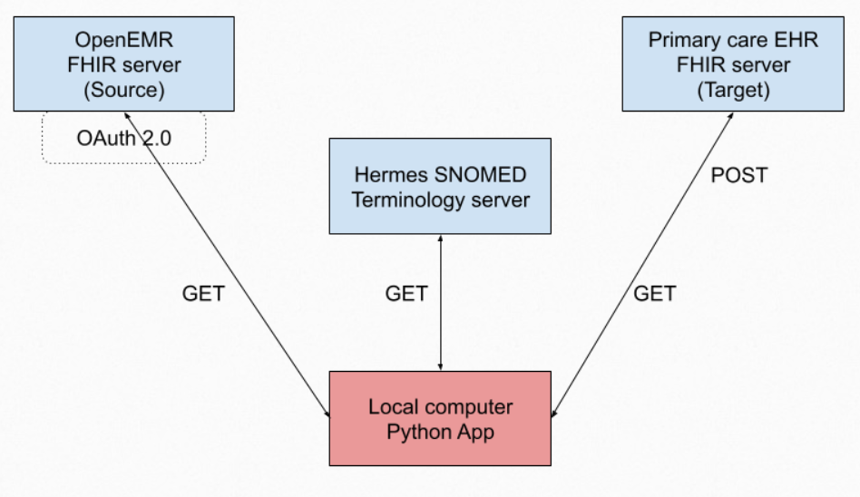

# FHIR Powered ETL Project

This project implements a healthcare-focused ETL Extract Transform Load pipeline using Python and FHIR APIs. The pipeline retrieves clinical data from a FHIR server, applies structured transformations, and loads the processed data for downstream analysis and interoperability use cases.

The project demonstrates standards-based healthcare data exchange using FHIR, OAuth 2.0 authentication, and terminology services.

## Project Website

The project website provides detailed documentation, BPMN diagrams, screenshots, and insights derived from the ETL workflow.
[ETL Project Website] https://pages.github.iu.edu/shurmad/group4_health_info_standards/


## Project Overview

The ETL pipeline is designed as a sequence of tasks that extract healthcare data, transform it into analysis-ready formats, and load validated results into a target system or structured files.

The workflow emphasizes reproducibility, correctness, and alignment with healthcare interoperability standards.

## Core ETL Workflow

- Extract clinical data from a FHIR server using RESTful APIs

- Transform FHIR resources by filtering, restructuring, and normalizing fields

- Load processed data into structured JSON outputs

- Verify results through inspection of generated artifacts

## ETL Architecture Overview

The diagram below illustrates the end-to-end architecture of the ETL pipeline and the interaction between system components.


## Architecture Description

- OpenEMR FHIR server serves as the source system
- OAuth 2.0 is used for secure authentication and authorization
- A local Python application orchestrates all ETL steps
- Hermes SNOMED terminology server is queried to resolve clinical terminology relationships
- Transformed resources are loaded into a Primary Care EHR FHIR server as the target system

## Data Flow Summary

- GET requests retrieve Patient and clinical resources from the source FHIR server
- GET requests to Hermes resolve SNOMED terminology relationships
- The Python application performs transformations and validations
- POST requests load transformed resources into the target FHIR server

## Repository Structure

FHIR_Powered_ETL/
├── index.html                # Project homepage
├── bpmn.html                 # BPMN workflow visualization
├── etl_doc.html              # Detailed ETL documentation
├── insights.html             # Project insights and findings
├── team_contributions.html   # Team member contributions
├── about.html                # Project and team overview
│
├── css/                      # Website stylesheets
├── images/                   # Website images and diagrams
│   ├── about_image.png
│   ├── BPMN Diagram.png
│   ├── extraction_image.png
│   ├── github_image.png
│   ├── insights1.png
│   ├── insights2.png
│   ├── insights_image.png
│   ├── interoperability_image.png
│   ├── loading_image.png
│   ├── project_architecture.png
│   └── transformation_image.png
│ 
├── task1.py                  # ETL Task 1 script
├── task2.py                  # ETL Task 2 script
├── task3.py                  # ETL Task 3 script
├── task4.py                  # ETL Task 4 script
├── task5.py                  # ETL Task 5 script
├── refresh_token.py          # OAuth token refresh utility
│
├── README.md                 # Project documentation
└── requirements.txt          # Python dependencies

## Prerequisites

- Python 3.10 or higher
- Access to a FHIR server
- Valid OAuth access token for the FHIR API

## Installation and Setup

1. Clone the repository
```
https://github.iu.edu/shurmad/group4_health_info_standards/tree/master
```
2. Create and activate a virtual environment
```
python -m venv .venv
source .venv/bin/activate
```
On Windows:
```
.venv\Scripts\activate
```
3. Install dependencies
```
pip install -r requirements.txt
```
## Configuration

### Access Token Setup

- Locate the file where the OAuth access token is stored
- Replace the placeholder value with your valid access token
- Save the file before running any ETL tasks
- If the token expires, refresh it using:
```
python refresh_token.py
```

## Running the ETL Tasks

Tasks must be executed in sequence. Later tasks depend on outputs generated by earlier ones.

### Task 1 – Parent SNOMED Condition ETL
```
python task 1.py
```
- Extracts Patient and Condition resources from the OpenEMR FHIR API
- Queries the patient using FHIR search parameters:
  - name = Criselda
  - gender = female
- Retrieves the associated Condition with SNOMED code 444814009
- Queries the Hermes terminology server to resolve the parent SNOMED concept:
  - Sinusitis, SNOMED code 36971009
- Clones the Patient resource and create a new Condition resource using the parent concept
- POSTs both Patient and Condition resources to the Primary Care EHR FHIR server
- Saves generated payloads to:
  - patient_details_payload.json
  - parent_condition_payload.json

### Task 2 – Child SNOMED Condition ETL
```
python task 2.py
```
- Reuses the cloned Patient resource created in Task 1
- Queries the Hermes terminology server using the constraint syntax <<{code}
- Resolves the child SNOMED concept:
  - Viral sinusitis, SNOMED code 444814009
- Builds a new Condition resource using the child SNOMED concept
- POSTs the Condition resource to the Primary Care EHR FHIR server
- Saves the generated payload to:
  - child_condition_payload.json

### Task 3 – Blood Pressure Observation ETL
```
python task 3.py
```
- Queries OpenEMR for an existing Blood Pressure Observation for the source patient
- No existing Observation was found
- Creates a synthetic Observation using the following LOINC codes:
   - 85354-9 Blood pressure panel
   - 8480-6 Systolic blood pressure
   - 8462-4 Diastolic blood pressure
- Populates the Observation with readings of 122/83 mmHg
- POSTs the Observation resource to the Primary Care EHR /Observation endpoint

## Task 4 – Procedure ETL
```
python task 4.py
```
- Creates a Procedure resource for:
  - Functional endoscopic sinus surgery (procedure)
  - SNOMED code 1220582003 
- Populates required FHIR elements including:
  - status
  - code
  - subject 
  - performedDateTime
- POSTs the Procedure resource to the Primary Care EHR /Procedure endpoint

## Task 5 – HL7 v2 ADT_A01 Message Generation
```
python task 5.py
```
- Uses hl7apy to generate an HL7 v2 ADT_A01 message
- Extract patient and condition data from FHIR resources
- Map data into the following HL7 segments:
   - MSH for message header
   - PID for patient demographics
   - PV1 for visit information
   - DG1 for diagnosis details
- Includes ICD-10 code J32.9 for Sinusitis derived from parent_condition_payload.json
- Saves the generated HL7 message to:
  - hl7_patient.txt

